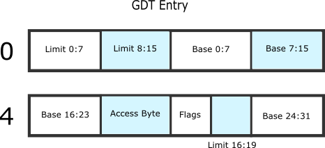

## Chapter 6: 全局描述表：GDT

多亏了 GRUB，你的内核已经不再处于实模式（real-mode）了，而是已经处于 [保护模式](http://en.wikipedia.org/wiki/Protected_mode)，这个模式允许我们使用微处理器的所有可用功能，比如虚拟内存管理，内存分页，安全的多任务。

#### GDT 是什么?

The [GDT](http://en.wikipedia.org/wiki/Global_Descriptor_Table) ("全局描述表") 是种数据解结构，它用来定义不同的内存区域：基地址、大小和访问优先级（比如执行和写入）。这些内存区域被叫做 ”段“。

我们要用 GDT 来定义不同的内存段：

* *"内核代码段"*: 内核代码，来存储可执行的二进制代码
* *"内核数据段"*: 内核数据
* *"内核堆栈段"*: 内核堆栈，来存储内核执行时的调用栈
* *"用户代码段"*: 用户代码，来存储用户程序的可执行的二进制代码
* *"用户数据段"*: 用户程序的数据
* *"用户堆栈段"*: 用户栈，来存储用户空间里代码执行时的调用栈

#### 如何加载 GDT?

GRUB 初始化 GDT ，但是 GDT 还没有对应到我们的内核。GDT 是用 LGDT 汇编指令来加载的。它会给出 GDT 描述结构的地址。


C 结构如下:

```cpp
struct gdtr {
	u16 limite;
	u32 base;
} __attribute__ ((packed));
```

**注意:**  指令 ```__attribute__ ((packed))``` 是告诉 gcc 编译器这个结构应该尽可能地减少占用内存。如果不写这个指令，gcc 会包含一些优化内存对齐和访问的字节。

***译者注：***
GNU C的一大特色就是__attribute__机制。__attribute__可以设置函数属性（Function Attribute）、变量属性（Variable Attribute）和类型属性（Type Attribute）。

__attribute__书写特征是：__attribute__前后都有两个下划线，并且后面会紧跟一对括弧，括弧里面是相应的__attribute__参数。

__attribute__语法格式为：

```cpp
__attribute__ ((attribute-list))
```

现在我们需要定义 GDT 表，然后用 LGDT 指令加载它。GDT 表可以存储到内存的任意地址，只要它的地址能被发送给使用 GDTR 寄存器的进程就可以。

GDT 表是由以下结构的段组成的：



C 结构如下：

```cpp
struct gdtdesc {
	u16 lim0_15;
	u16 base0_15;
	u8 base16_23;
	u8 acces;
	u8 lim16_19:4;
	u8 other:4;
	u8 base24_31;
} __attribute__ ((packed));
```

#### 怎么定义 GDT 表？

我们需要在内存中定义 GDT，并把它最终加载到 GDTR 寄存器中。

我们准备把它存储到以下地址：

```cpp
#define GDTBASE	0x00000800
```

[kernel/arch/x86/x86.cc](https://github.com/ningskyer/How-to-Make-a-Computer-Operating-System/blob/master/src/kernel/arch/x86/x86.cc) 中的方法 **init_gdt_desc** 初始化了一个 GDT 段。

```cpp
void init_gdt_desc(u32 base, u32 limite, u8 acces, u8 other, struct gdtdesc *desc)
{
	desc->lim0_15 = (limite & 0xffff);
	desc->base0_15 = (base & 0xffff);
	desc->base16_23 = (base & 0xff0000) >> 16;
	desc->acces = acces;
	desc->lim16_19 = (limite & 0xf0000) >> 16;
	desc->other = (other & 0xf);
	desc->base24_31 = (base & 0xff000000) >> 24;
	return;
}
```

 **init_gdt** 函数初始化 GDT，下面函数的某部分之后解释，它们是用来执行多任务用的。

```cpp
void init_gdt(void)
{
	default_tss.debug_flag = 0x00;
	default_tss.io_map = 0x00;
	default_tss.esp0 = 0x1FFF0;
	default_tss.ss0 = 0x18;

	/* 初始化 GDT 段 */
	init_gdt_desc(0x0, 0x0, 0x0, 0x0, &kgdt[0]);
	init_gdt_desc(0x0, 0xFFFFF, 0x9B, 0x0D, &kgdt[1]);	/* code */
	init_gdt_desc(0x0, 0xFFFFF, 0x93, 0x0D, &kgdt[2]);	/* data */
	init_gdt_desc(0x0, 0x0, 0x97, 0x0D, &kgdt[3]);		/* stack */

	init_gdt_desc(0x0, 0xFFFFF, 0xFF, 0x0D, &kgdt[4]);	/* ucode */
	init_gdt_desc(0x0, 0xFFFFF, 0xF3, 0x0D, &kgdt[5]);	/* udata */
	init_gdt_desc(0x0, 0x0, 0xF7, 0x0D, &kgdt[6]);		/* ustack */

	init_gdt_desc((u32) & default_tss, 0x67, 0xE9, 0x00, &kgdt[7]);	/* descripteur de tss */

	/* GDTR 结构*/
	kgdtr.limite = GDTSIZE * 8;
	kgdtr.base = GDTBASE;

	/* 复制 GDTR 到内存区域中*/
	memcpy((char *) kgdtr.base, (char *) kgdt, kgdtr.limite);

	/* 加载 GDTR 寄存器*/
	asm("lgdtl (kgdtr)");

	/* 初始化段 */
	asm("   movw $0x10, %ax	\n \
            movw %ax, %ds	\n \
            movw %ax, %es	\n \
            movw %ax, %fs	\n \
            movw %ax, %gs	\n \
            ljmp $0x08, $next	\n \
            next:		\n");
}
```
