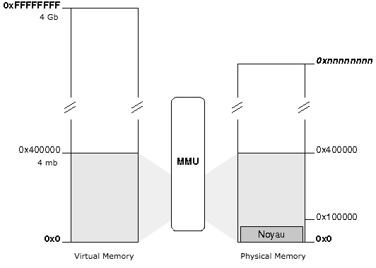

## Chapter 8: 内存管理：物理内存与虚拟内存理论

在跟 GDT 相关的第六章，我们看到通过内存分段技术，使用段选择器和偏移量来计算出物理内存地址。

在这一章中，我们会实现分页技术，它能将线性段地址转换成物理地址。

#### 我们为什么需要分页技术？

分页技术能给内核带来：

* 将硬盘驱动器用作内存，而不是受限于机器的 RAW 内存限制。
* 使每个进程拥有一个独立的内存空间
* 动态允许和禁止内存空间的使用

在使用分页技术的系统中，每个进程在它独有的 4gb 内存区域中运行，绝不会影响其他进程或内核的内存。分页技术简化了多任务管理的复杂度。

```译者注```:
如果仅适用分段地址转换，那么存储在物理内存中的一个数据结构将包含其所有部分。但如果使用了分页，那么一个数据结构就可以一部分存储在物理内存中，而另一部分保存在磁盘中。这也就是分页机制在现代内存管理中存在的重要性。


#### 分页是怎么工作的？

将线性地址转换成物理地址是通过多个步骤完成的：

1. 处理器通过 `CR3` 寄存器获取到页目录表的物理地址（入口）。
2. 线性地址的前 10 比特（0 到 1023）存储着页目录表中一个表项的地址。这个页目录表项包含了一个页表的物理地址。
3. 接下来的 10 比特存储着页表中一个表项的地址，这个页表就是步骤二中取到的页表。这个地址指向一个 4k bit 大小（2^12=4^10=4096）的页。
4. 最后 12 比特则代表了页中的地址位置，此页就是在步骤三中取到的页。页中存储的是


#### 页表和页目录的格式

这两种类型的入口（页表和页目录）看起来是一样的。只有灰色字段在操作系统中用到了。


* `P`: 指示页或者表已经加载到物理内存中
* `R/W`: 指示页或者表是否可写（1 为可写）
* `U/S`: 为 1 时表示允许非优先任务的访问
* `A`: 指示页或者表是否已经访问过
* `D`: （只对表有效）指示页是否已经写入过
* `PS`: （只对页目录有效）指示页的大小——
    * 0 = 4kb
    * 1 = 4mb

**Note:** 页目录或者页表里的物理地址使用 20 比特表示的，因为这些地址被分配了 4kb，所以后 12 比特应该是 0。

* 一个页目录表或者页表使用 1024*4 = 4096 bytes = 4k 存储空间
* 一个页表能处理 1024 * 4k = 4 Mb 空间
* 一个页目录表能处理 1024 * (1024 * 4k) = 4 Gb 空间

#### 如何使能分页？

要使能分页，我们需要将 `CR0` 寄存器的第 31 比特设置为 1：

```asm
asm("  mov %%cr0, %%eax; \
       or %1, %%eax;     \
       mov %%eax, %%cr0" \
       :: "i"(0x80000000));
```

但是之前，我们需要用至少一个页表来初始化页目录表。

#### 一致映射

通过一致映射模型，当虚拟内存的前 4 MB 空间与物理内存的前 4 MB 空间一致的时候，页就会应用到内核中。



模型很简单：虚拟内存的第一页跟物理内存的第一页对应，虚拟内存第二页跟物理内存第二页对应，以此类推...


